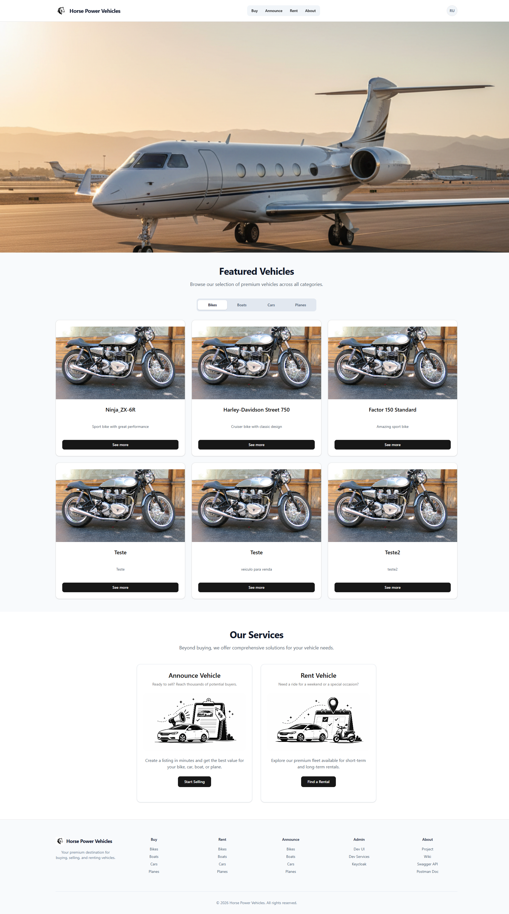
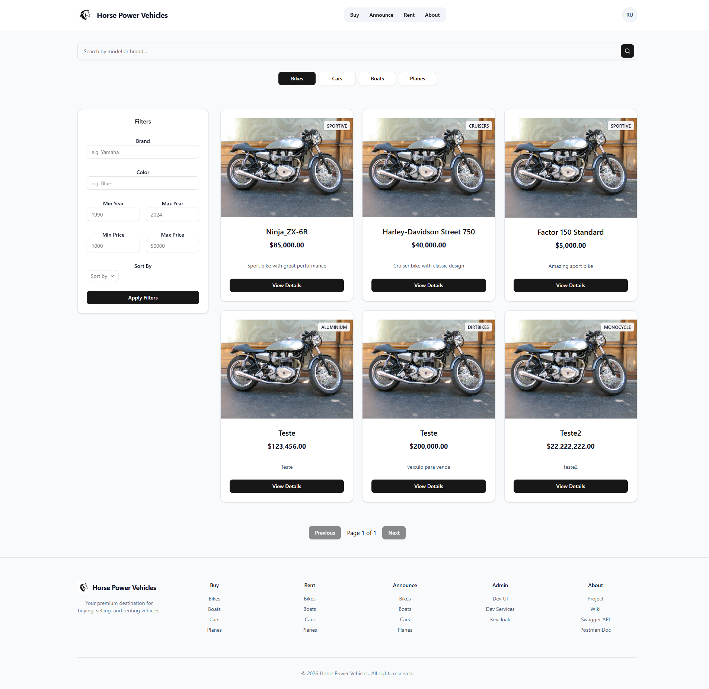
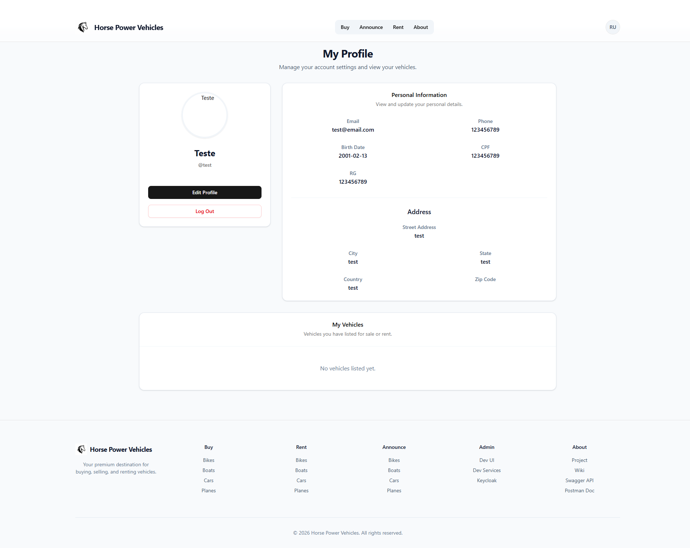

# **Horse Power Vehicles — Vehicle Marketplace (Backend)**

A robust backend API built with **Quarkus 3.21.1** and **Java 21** that powers a comprehensive vehicle marketplace for buying, selling, and renting cars, bikes, boats, planes, and more. The system provides complete vehicle lifecycle management, document handling, payment processing, and role-based access control for both customers and administrators.

---

## **📘 About This Documentation**

This README provides a high-level overview of the backend architecture, core features, and setup instructions.

**📚 For detailed documentation, visit the [Wiki](https://github.com/Thiago-M-Silva/vehicle-marketplace/wiki)**

---

## **🚀 Getting Started**

### **Prerequisites**

- **Java** 21
- **Quarkus** 3.21.1
- **Node.js** 22.14.0
- **Docker** & Docker Compose

### **Installation & Running**

\# Clone the repository  
git clone https://github.com/Thiago-M-Silva/vehicle-marketplace.git  
cd vehicle-marketplace

\# Configure environment variables  
cp .env.example .env

\# Start the application  
./mvnw quarkus:dev

### **Development URLs**

| Service              | URL                                                                                    |
| -------------------- | -------------------------------------------------------------------------------------- |
| Quarkus Dev UI       | [http://localhost:8080/q/dev-ui/extensions](http://localhost:8080/q/dev-ui/extensions) |
| Swagger API Docs     | [http://localhost:8080/q/swagger-ui/](http://localhost:8080/q/swagger-ui/)             |
| Keycloak             | [http://localhost:8081](http://localhost:8081/)                                        |
| Frontend (reference) | [http://localhost:5173](http://localhost:5173/)                                        |

---

## **🏗️ Architecture Overview**

The application follows a **monolithic architecture** with a clean layered structure, integrating multiple external services:

### **Technology Stack**

- **Java** - Main language
- **Quarkus** - Main java framework
- **React** - Frontend node framework
- **PostgreSQL** — Structured relational data
- **MongoDB** — Document and file storage
- **Stripe** — Payment processing
- **Keycloak** — Authentication and role-based access control (RBAC)

### **Application Layers**

Controllers → HTTP endpoints and request handling  
Services → Business logic and orchestration  
Repositories → Data access and persistence  
Models → Domain objects and entities  
Middlewares → Request validation and filtering  
Infra → External service integrations

---

## **✨ Core Features**

### **🚗 Vehicle Management**

- Full CRUD operations for vehicles
- Multi-type support (cars, bikes, boats, planes, etc.)
- Document upload and management (PDF, JPG, PNG)
- Advanced search and filtering capabilities

### **👥 User Management**

- Self-service customer registration
- Admin-controlled seller and admin account creation
- Personal dashboard with trade history
- Role-based permissions and access control

### **💼 Transaction System**

- Vehicle purchase workflows
- Flexible rental options (daily or custom periods)
- Stripe-powered secure payment processing
- Automated email confirmations and invoices

---

## **🧰 Technology Stack**

| Category           | Technologies            |
| ------------------ | ----------------------- |
| **Core**           | Java 21, Quarkus 3.21.1 |
| **Databases**      | PostgreSQL, MongoDB     |
| **Payments**       | Stripe                  |
| **Email**          | Resend                  |
| **Authentication** | Keycloak (OIDC)         |
| **Infrastructure** | Docker, Docker Compose  |
| **Documentation**  | Swagger (OpenAPI)       |
| **Testing**        | JUnit, Mockito          |

---

## **📂 Project Structure**

VEHICLE-MARKETPLACE/  
└── src/  
 ├── main/  
 │ ├── java/org/acme/  
 │ │ ├── abstracts/ \# Abstract base classes  
 │ │ ├── controllers/ \# REST endpoints  
 │ │ ├── db/seeding/ \# Database seeders  
 │ │ ├── dtos/ \# Data transfer objects  
 │ │ ├── enums/ \# Enumerations  
 │ │ ├── exceptions/ \# Custom exceptions  
 │ │ ├── infra/ \# External integrations  
 │ │ ├── interfaces/ \# Contracts and interfaces  
 │ │ ├── middlewares/ \# Request interceptors  
 │ │ ├── model/ \# Domain models  
 │ │ ├── repositories/ \# Data access layer  
 │ │ └── services/ \# Business logic  
 │ └── resources/  
 │ ├── db/ \# Database migrations  
 │ ├── files/ \# Static files  
 │ ├── import/ \# Import data  
 │ ├── webui/ \# Web UI assets  
 │ └── application.properties  
 └── test/java/org/acme/ \# Test suite  
 ├── controllers/  
 ├── exceptions/  
 ├── infra/  
 ├── middlewares/  
 └── services/

---

## **🔌 External Integrations**

### **Keycloak**

- **OIDC-based authentication** for secure user sessions
- **Role-based authorization** (Customer, Seller, Admin)
- **Automated synchronization** with marketplace database

### **Stripe**

- **Secure payment processing** for purchases and rentals
- **Webhook integration** for real-time transaction events
- **Multiple payment methods** (Card, Boleto, PIX) in test mode

### **Resend**

- **Transactional email delivery** for confirmations and notifications
- **Automated invoice generation** and distribution
- **Password recovery** (planned feature)

---

## **Demo**

- Demo video: [vehicle_marketplace_add_vehicle](Vehicle_marketplace_prints_videos/2026-07-16%2015-20-57.mkv)

## **Images**

- 
- 
- 

## **📎 Additional Resources**

For comprehensive documentation including architecture diagrams, domain models, API examples, and integration guides:

**👉 [Visit the Wiki](https://github.com/Thiago-M-Silva/vehicle-marketplace/wiki)**
